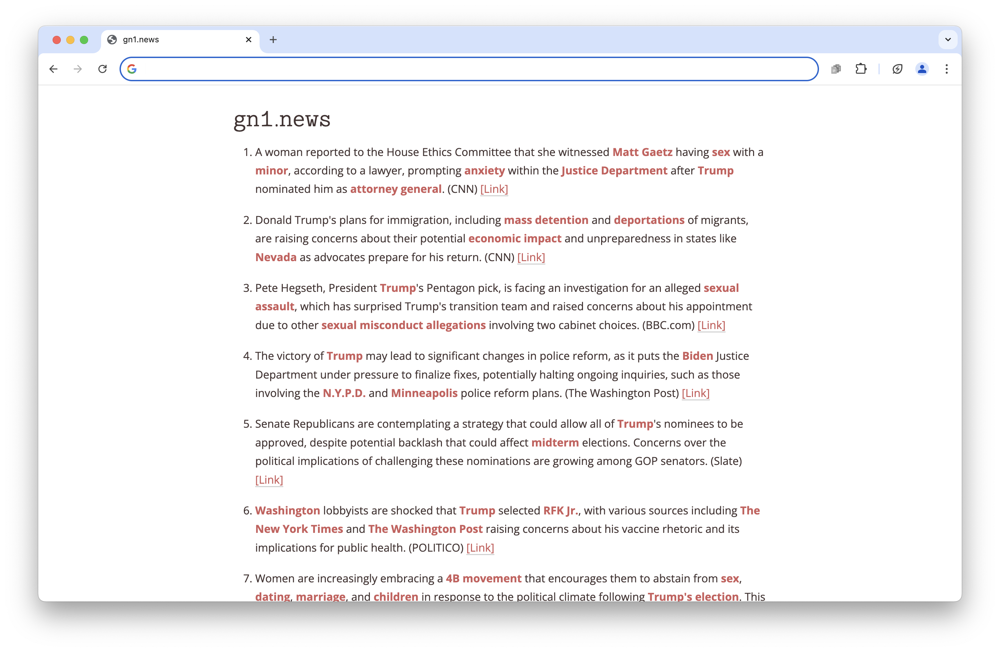

# Text Only News; Summarized and Translated by OpenAI API

# Introduction
A client side application that returns the top stories from the Google News RSS feed headlines from the 4-5 related articles are summarized and keywords are highlighted for quick reading. 

# Parameters
Various variables set by URL parameters:

- apiKey: OpenAI API key used for authentication.
- rssUrl: The URL of the RSS feed; built for: https://news.google.com/rss?hl=en-US&gl=US&ceid=US:en Needs a CORS proxy (https://corsproxy.io/) to download.
- decodingUrl: A URL used for decoding the Google News URLs; code based on: https://gist.github.com/huksley/bc3cb046157a99cd9d1517b32f91a99e Some API that will return a decoded Google News URL; nice to have, not necessary. In forked code, calls to this API should be removed. 
- maxItems: The maximum number of items to display (default is 15).
- language: The language for translation (default is English, any string understandable by ChatGPT acceptable: en, English, ingles, etc)

# Related Sites 
Awesome Text Only News (https://github.com/localjo/awesome-text-only-news) has many alternative similar sites. This project was created because most of the sites above have issues such as including not so newsworthy articles or being repetitive. 
